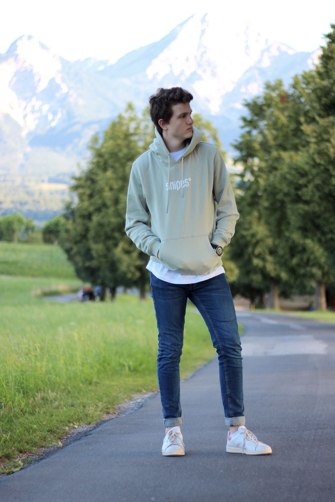

# Background-Changer
 Background changer

• Collected the dataset for the project from various segmentation datasets like COCO, ADE20K, VOC pascal <br />
• Developed a custom deep learning model using the State of the Art HRNet[[Link](https://arxiv.org/pdf/1904.04514.pdf)] architecture along with a combined loss function
comprising of Boundary and Cross-Entropy loss<br />
• Deployed the model that helps to customize the background for an image using semantic segmentation using Azure<br />
• Technologies Used: PyTorch, Azure<br />
 
## Steps to Run the Code
 1. Clone the repository
 ```
 git clone https://github.com/kshitiz-1225/Background-Changer.git
``` 
 2. Install the Necessary Dependencies
```
pip install -r requirements.txt 
```
3. Download the Weights from the [[Link](https://drive.google.com/file/d/1zo-eXWyG8-UEz9h_jaOUY-bt2A1ywsPr/view?usp=sharing)]

4. Execute the following commands
```
python main.py --image <path to foreground image> --bg_image <path to background image> --weights <path to weights>
```

# DEMO
  
# Input

<br />
Foreground image<br />

<br />
Background image

# Output


